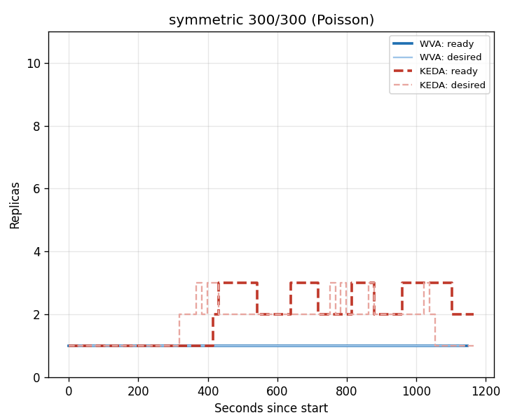
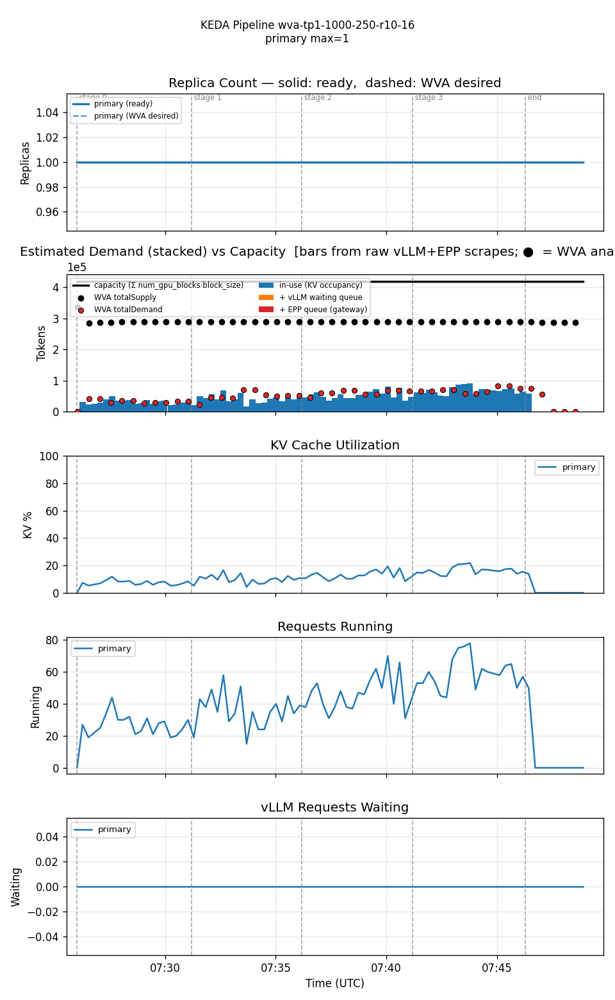
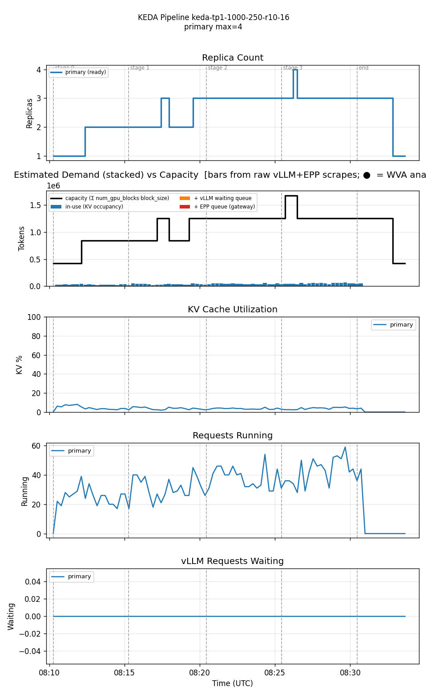
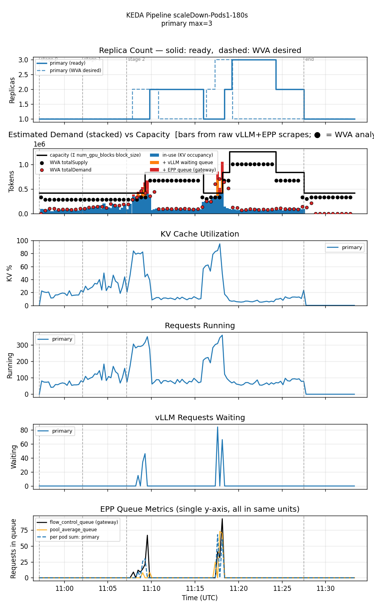
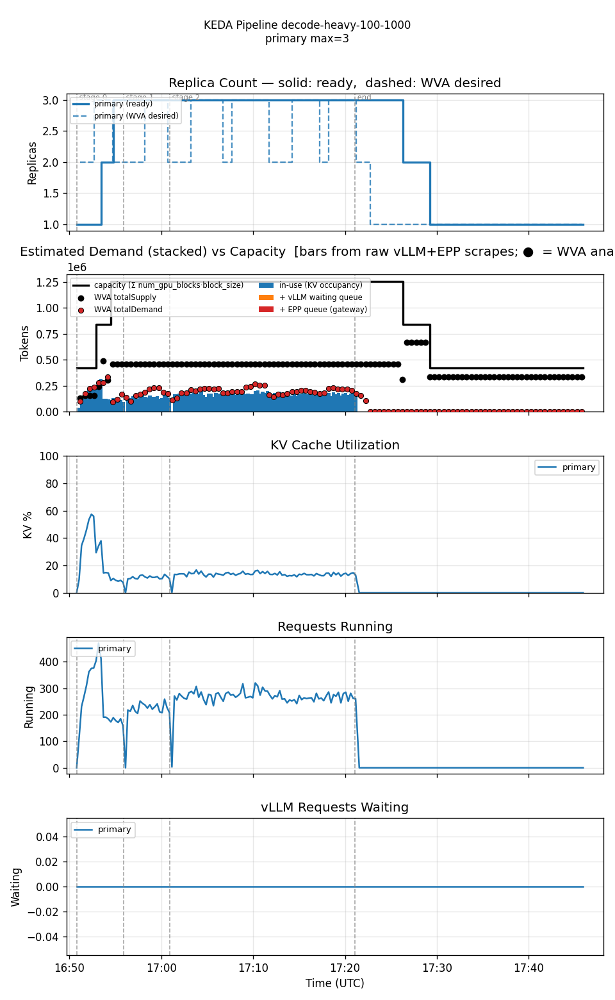
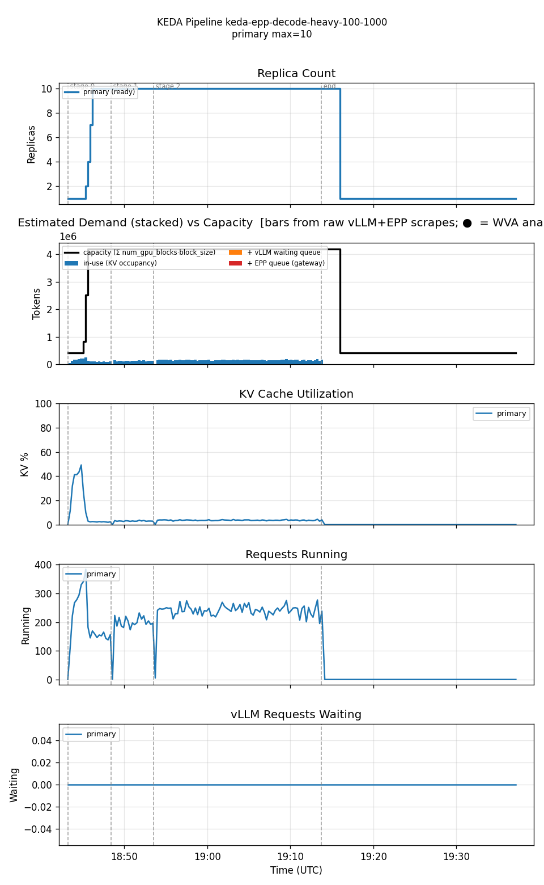
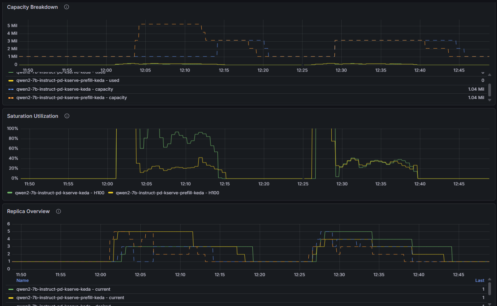

# What should decide how many replicas an LLM serves on?

**A request threshold, or a capacity model — five runs on a live cluster.**

> Workload Variant Autoscaler · **KEDA is the actuator in every run here.**
> Every run is one model, one accelerator, one variant. Figures: [`figures/src/`](./figures/src).

---

## Before the numbers

**The question.** Both stacks scale the *same* Deployment through the *same* KEDA `ScaledObject`. The **only** thing under test is *what computes the number KEDA actuates.*

| Arm | What computes the target |
|---|---|
| **KEDA alone** | A **threshold on a serving metric**: scale when running requests pass **16 per pod**. |
| **WVA + KEDA** | A **capacity model**: scale when token demand approaches **measured KV capacity**. |

**Colour code:** in the tables below, the highlighted arm is the one that won that row. Every run is **one model, one accelerator, one variant** — the single-variant case.

**The five runs**

| # | What it tests |
|---|---|
| 1 | Bursty arrivals that fit in one pod (symmetric 300/300) |
| 2 | Cheap requests arriving in bulk, rising rate (prefill-heavy 1000/250) |
| 3 | Prefill-heavy, sustained past the crossover rate |
| 4 | Decode-heavy (100/1000), the same sustained load |
| 5 | Prefill and decode sized apart vs together |

> **If you have a minute:** read *The KEDA arm* below, then **Runs 3 and 4** (that pair identifies the mechanism), then the **Recommendation**.

---

## All five runs on one page

WVA held fewer GPUs every time. Run 3 is the only one where that saving costs something.

| # | What we ran | GPUs held (WVA vs other) | Dropped (WVA vs other) | What it means |
|---|---|---|---|---|
| 1 | symmetric 300/300, 10 req/s | **1.00 vs 1.88** | 0 vs 30 | Half the GPU, same latency |
| 2 | prefill-heavy 1000/250, rates 10 → 16 | **1.00 vs 2.46** | 0 vs 21 | 2.5× the GPUs at a third of the utilization |
| 3 | prefill-heavy 1000/250, sustained @ 24 | **1.56 vs 4.01** | 101 vs 14 | Cheaper — and pays for it in the tail |
| 4 | decode-heavy 100/1000, sustained @ 24 | **2.21 vs 5.97** | 6 vs 2 | Cheaper, no tail cost; KEDA pinned at its cap |
| 5 | prefill / decode split on 6 GPUs | **3:3 vs 5:1** | — | Sized apart, one role starves |

> **The honest shape of it:** WVA holds fewer GPUs in all four single-variant runs. The tail cost appears only on prefill-heavy traffic (Run 3) and is *absent* when the same config runs decode-heavy (Run 4) — so it is a property of the **token shape**, not of consolidating replicas. Both directions are the same lesson: **a fixed request threshold is only valid for the shape it was tuned on.**

---

## The KEDA arm runs the *shipped* configuration

Unmodified well-lit-path settings — aggressive by design, and they over-scale.

```yaml
# hack/benchmark/scenarios/keda-epp/scaledobject.yaml
# mirrors llm-d PR #1981, the KEDA conversion of the EPP autoscaling guide
scale up when, per pod:
    50 queued requests
    16 running requests
scale down:
    Percent 100 / 15s   # N → 1 in one step
```

**Yes — this can be tuned. That is the point:**

- **`16 running requests per pod` is a capacity number** — it moves with the model, the accelerator, the parallelism, and the pod shape.
- **It moves with the traffic too:** tuned for 300/300 tokens, it over-scales on 1000/250.
- So it is **re-derived per model × accelerator × configuration — and again when the workload shape changes.**

> In every run here the threshold bought replicas that did no work — **2.46× and 4.01×** the count WVA held, at **3.3% average KV-cache utilization.** Softening its scale-down would not close the gap: a slower drain holds those replicas *longer*.

**`"Scale at 75% KV"` means the same thing on any model, accelerator, or request shape — WVA measures the per-variant capacity itself. `"16 running requests"` is that capacity, hand-derived.**

---

## Run 1 — symmetric traffic: same latency on half the GPU

**Setup:** 300/300 tokens, Poisson 10 req/s.

**Hero:** **1.00 vs 1.88 GPUs held** — −47% GPU-time, same latency.



- Solid = replicas ready; faint = what each controller asked for.
- KEDA scales at 16 running requests per pod; WVA scales when demand nears KV capacity.
- Bursts cross that request line even though the mean fits in one pod, so **KEDA cycles 1↔2↔3** and drops ~30 requests. WVA holds a stable target.

---

## Run 2 — prefill-heavy: counting requests is not measuring load

**Setup:** ≈1000/250 tokens, rates 10 → 16.

**Hero:** **1.00 vs 2.46 GPUs held** — −59% GPU-time, **nothing queued on either arm.**

| | WVA + KEDA — flat at 1 replica | KEDA-EPP alone — steps to 4 |
|---|---|---|
| |  |  |

- WVA's target never moves; KEDA-EPP steps 2 → 3 → 4 as the request count climbs.
- WVA's demand stays far under the capacity line — that headroom is what it reads.
- KV panel: WVA holds 5–15%, KEDA-EPP 2–8% — the *same* demand spread across more replicas.
- **Queues are flat on both arms**, so the extra replicas bought no service — only cost.

---

## Run 3 — prefill-heavy sustained: cheaper, but paid for in the tail

**Setup:** ≈1000/250 tokens, 20-minute sustained stage at rate 24.

**Hero:** **1.56 vs 4.01 GPUs held** — −61% GPU-time — *paid for in the tail.*

| | WVA + KEDA — two cycles, then flat at 1 | KEDA-EPP alone — settles at 5 and holds |
|---|---|---|
| |  |  |

- WVA runs two overshoot-and-correct cycles, then holds 1 replica; KEDA-EPP climbs 1 → 2 → 4 → 5 and holds, with vLLM waiting at exactly 0 throughout.
- **The errors and the tail live in WVA's cycles:** each drain to one replica cuts live streams. Capping the drain rate (Pods 1 / N s) is what got WVA to converge — *not* thresholds.

> **Honest caveat (a WVA bug, not a defense of thresholds):** WVA's compute-capacity estimate recovers toward the memory bound once the queue drains, so it released replicas while arrivals were unchanged. A replacement estimator exists behind a build flag and has **not** yet been measured on this workload — read the tail as *current behaviour*, not settled. This is the one axis where a reactive threshold wins today.

---

## Run 4 — decode-heavy: the threshold is degenerate on the other shape

**Setup:** decode-heavy ≈100/1000 tokens, same rate ladder as Run 3.

**Hero:** **2.21 vs 5.97 GPUs held** — −63% GPU-time, and **no tail cost at all.**

| | WVA + KEDA — one cycle, then low | KEDA-EPP alone — pinned at 10 |
|---|---|---|
| |  |  |

- WVA climbs 1 → 2 → 3 early and drains back to 1: one cycle, against two or three on the prefill-heavy runs at the *same config*.
- **KEDA-EPP reaches its 10-replica cap within three minutes — before the sustained stage even starts — and holds for ~30 minutes.**
- KV utilization stays low and the EPP queue never builds on either arm: neither was short of capacity. The difference is entirely in *what each one asked for.*
- **The cap is the tell.** A trigger that pegs immediately and ignores the 16 → 20 → 24 rate ladder is not measuring load — the threshold calibrated for prefill-heavy traffic is *degenerate* on decode-heavy.

---

## Run 5 — prefill / decode sized apart, and one role starves

**Setup:** prefill / decode split on 6 GPUs.

**Hero:** **3 : 3 vs 5 : 1** prefill : decode replicas — same 6 GPUs, placed differently.



- Green is decode, yellow is prefill. Panels: capacity · load per replica · replicas.
- Sized apart, prefill asked first and the 6-GPU pool was gone before decode could grow — **decode pods left pending, load per replica skewed.**
- Both windows are **WVA — role-awareness off, then on** — *not* WVA vs KEDA. Sizing each role alone is exactly what a **per-Deployment scaler does**; it has no notion of the role coupling.

---

## What the five runs generalise to

| Reality | KEDA alone | WVA + KEDA | Evidence |
|---|---|---|---|
| Bursty arrivals around a steady mean | Threshold crossings → oscillation and dropped requests | Capacity model → stable target | Run 1 |
| Cheap requests arriving in bulk | Counts requests, not the work they represent | Scales on GPU pressure, not arrivals | Run 2 |
| Sustained load past the crossover rate | Converges fast and holds — at 4.01 replicas | Converges cheaper, but cycles on the way | Run 3 |
| The token shape changes which resource binds | A threshold tuned on one shape is **degenerate** on another — pinned at the replica cap on decode-heavy | Utilization thresholds mean the same on any shape | Runs 3 + 4 |
| Prefill / decode pools | No notion of role; each Deployment scales alone | Roles sized together | Run 5 |
| Heterogeneous, scarce GPUs | Every `ScaledObject` competes for any GPU | Cost-aware allocation across the pool | *not measured* |
| Mixed-priority traffic on one model | One threshold averages all classes together | Sized to the tightest SLO class | *not measured* |

> The first five rows are measured — row 3 is the one that does not go WVA's way. The last two are argued, not tested.

**A threshold reasons about one Deployment. A capacity model reasons about the cluster.**

---

## Recommendation

**Run today**
- **WVA + KEDA** as the default for steady and moderate load — cheaper at equal service in every run below saturation.
- **Keep KEDA as the actuator.** Nothing in the deployment changes except *what publishes the target.*
- **Cap the scale-down drain** (`Pods 1 / 120s` was the best cost-and-reliability point of six legs tested).
- Where **the tail is the SLO** and load sits past the crossover rate, **KEDA-EPP is still the safer default.**

**Build next**
- **Stabilization inside WVA**, so the drain rate is a WVA decision rather than a per-deployment HPA behavior block.
- **Land the capacity-estimator fix** and re-run Run 3 — its tail is the one axis where a reactive threshold wins outright.
- **Measure the argued claims:** two models contending for one pool, and mixed accelerators.

> **What this evidence does not cover:** one model, one accelerator, one variant per run; single runs per arm. Heterogeneous placement and criticality are argued here, not measured. Run 5 compares WVA role-awareness off vs on, not WVA against KEDA.

---

## Appendix — headline numbers per run

| Run | Tokens | Load | GPUs held (WVA vs other) | Dropped (WVA vs other) |
|---|---|---|---|---|
| 1 | 300/300 | Poisson 10 req/s, 7 200 req/arm | 1.00 vs 1.88 | 0 vs 30 |
| 2 | ≈1000/250 | rates 10 → 16, 15 600 req/arm | 1.00 vs 2.46 | 0 vs 21 |
| 3 | ≈1000/250 | sustained @ 24, 39 600 req/arm | 1.56 vs 4.01 | 101 vs 14 |
| 4 | ≈100/1000 | sustained @ 24, 39 600 req/arm | 2.21 vs 5.97 | 6 vs 2 |
| 5 | prefill/decode | 6-GPU split | 3:3 vs 5:1 | — |

*Run 3's WVA leg shown is `scaleDown = Pods 1/180s` (cheapest of six legs); `Pods 1/120s` was the most reliable (78 errors, TTFT p99 4.30 s).*
